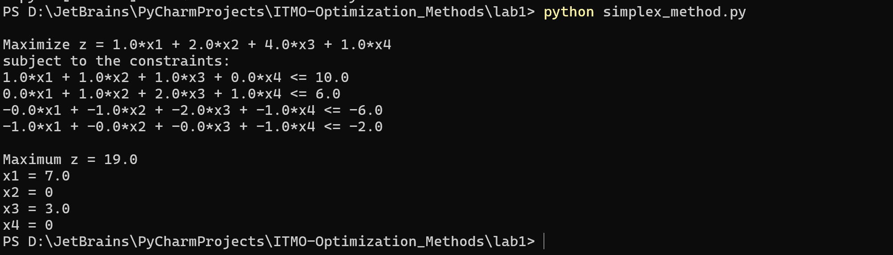
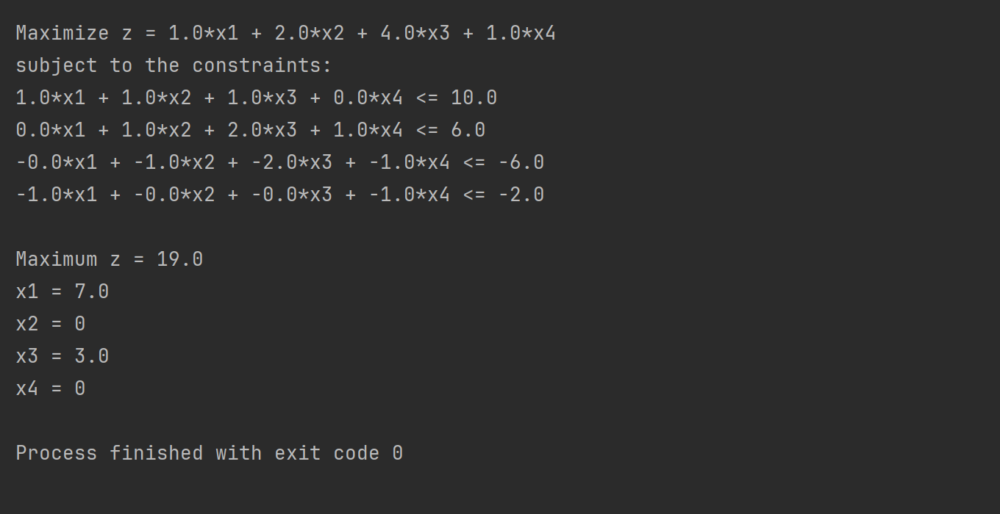
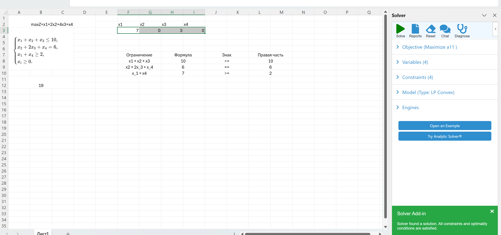
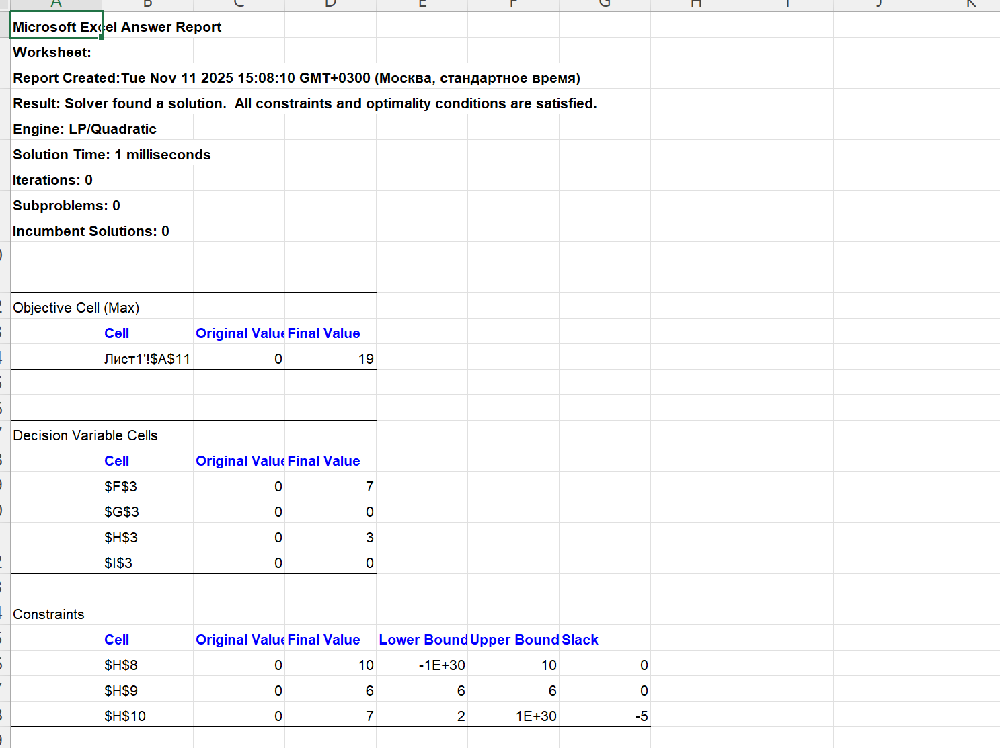

## Задание №1. Разработка программного обеспечения для решения задачи линейного программирования

#### Студент: Данилова Анастасия Алексеевна

#### Группа: МЕТОПТ 1.1

#### Вариант: 11

### Задание по теме «Решение задач линейного программирование»

В рамках данной работы вы закрепите навыки работы с математической постановкой задачи линейного
программирования, получения из нее допустимого канонического вида и ее решения с помощью симплекс-метода.
Также усилите компетенции в области математического программирования, когда будете реализовывать решение ЗЛП в языке
программирования высокого уровня.

#### Что дано на входе?

Общая задача линейного программирования – математическая запись: целевая функция (он же критерий эффективности);
ограничения.

#### Что необходимо сделать?

Необходимо реализовать компьютерную программу на языке высокого уровня (Python или эквивалентный), которая будет решать
ЗЛП (полный цикл), выполняя следующие основные шаги:

1. Считывание текстового файла с файла с постановкой ЗЛП (формат файла - на ваше усмотрение).
2. Приведение задачу к каноническому виду.
3. Формирование вспомогательной задачи.
4. Решение вспомогательную задачу.
5. Переход к основной задаче (если есть возможность).
6. Решение основную задачу.
7. Запись ответа в форме: оптимальная точка, значение целевой функции в оптимальной точке: или информацию, что решений
   нет, указав причину.

### Решение

#### Описание алгоритма ЗЛП

Алгоритм решения задачи линейного программирования (ЗЛП) реализован с помощью симплекс-метода.
Он проходит полный цикл — от считывания задачи, приведения к каноническому виду, до нахождения оптимального решения.

#### Краткий ход работы алгоритма

1. **Ввод исходных данных**
    Программа получает:

* тип задачи (max или min),

* коэффициенты целевой функции,

* систему ограничений,

* правые части ограничений.

Эти данные могут быть введены вручную или считаны из текстового файла.

```python
obj_type = 'max'
obj_coeffs = [1, 2, 4, 1]
constraints_raw = [
    ([1, 1, 1, 0], '<=', 10),
    ([0, 1, 2, 1], '=', 6),
    ([1, 0, 0, 1], '>=', 2)
]
```
2. **Приведение задачи к каноническому виду**

Все ограничения переводятся к виду:

$$ a_1x_1 + a_2x_2 + ... + a_nx_n \le b $$ 

Равенства и «≥» преобразуются соответствующим образом (умножением на −1 или разбиением).
```python
obj, constraints, rhs, accuracy, is_maximization = preprocess_lp(
    obj_type, obj_coeffs, constraints_raw, accuracy=6
)
```

3. Построение симплекс-таблицы
Создаётся таблица, где строки — ограничения, а столбцы — коэффициенты переменных и свободные члены.
Добавляются дополнительные (slack) переменные, чтобы превратить неравенства в равенства.
```python
table = [[0 for _ in range(n + 1 + m)] for _ in range(m + 1)]
```

4. Итерационный процесс
* Выбирается ведущий столбец (наиболее отрицательный коэффициент в строке Z).
* Выбирается ведущая строка (по правилу минимального отношения).
* Таблица пересчитывается (поворот вокруг опорного элемента).
* Обновляется базис.
* Процесс продолжается, пока в строке Z нет отрицательных коэффициентов.

```python
while any(round_value(x, accuracy) < 0 for x in table[0][:-1]):
    # выбор ведущего столбца и строки
    # пересчёт таблицы
    # обновление базиса

```

5. Вывод оптимального решения
После завершения итераций из таблицы извлекаются значения базисных переменных (оптимальные значения $$x_i$$)
и вычисляется оптимальное значение целевой функции $$Z*$$.

```python
return z_value, answers

```

6. Вывод результата
Программа отображает:

* тип задачи,
* вид целевой функции и ограничений,
* найденные значения переменных и значение целевой функции.

```python
print(f"Maximum z = {z_value}")
for i in range(len(answers)):
    print(f"x{i + 1} = {answers[i]}")

```

#### Инструкция — как развернуть и запустить программу

1. Скачать python 3.10+
2. Сохранить код в файл
3. Создать текстовый файл 'task1.txt' с задачей в той же папке по структуре:
```text
max
1 2 4 1
3
1 1 1 0 <= 10
0 1 2 1 = 6
1 0 0 1 >= 2
accuracy=6
```
4. Запустить программу:
```python
python simplex_method.py
```

5. В консоли появится:



#### Демонстрация работы программы

1. Запуск в PyCharm:

Моя задача:
```text
max
1 2 4 1
3
1 1 1 0 <= 10
0 1 2 1 = 6
1 0 0 1 >= 2
accuracy=6
```

Результат работы:


2. Запуск в консоли:


#### Задача по соответствующему варианту:

Максимизировать: $$Z = x_1 + 2x_2 + 4x_3 + x_4$$

При условиях:

$$x_1 + x_2 + x_3 \le 10$$
$$x_ 2 + 2x_3 + x_4 = 6$$
$$ x_1 + x_4 \ge 2$$

#### Решение с помощью Exel



Можно увидеть, что Microsoft Exel с помощью расширения "Поиск решений" тоже решил задачу и получил аналогичный коду
ответ:
$$ x_1 = 7, x_2 = 0, x_3 = 3, x_4 = 0, Z = 19 $$



#### Вывод

В процессе выполнения работы я подробно изучила принципы симплекс-метода и этапы решения задач линейного программирования.
Особенно полезным было понимание того, как исходная задача преобразуется в каноническую форму и как формируется симплекс-таблица.
Основная трудность заключалась в корректной обработке знаков ограничений и стабильной работе при преобразовании равенств и неравенств.
Преодолеть её удалось с помощью пошаговой отладки и проверки промежуточных таблиц.
Сравнение результатов с Excel подтвердило правильность алгоритма и дало уверенность в понимании теории.
Работа оказалась полезной для закрепления навыков программирования и математического моделирования.


<script
  src="https://cdn.mathjax.org/mathjax/latest/MathJax.js?config=TeX-AMS-MML_HTMLorMML"
  type="text/javascript">
</script>