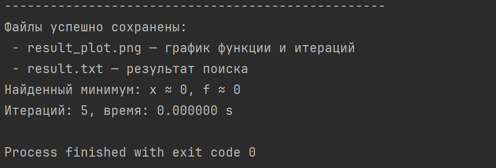
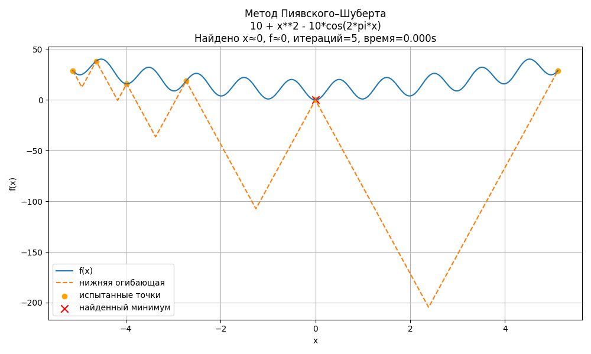

## Задание №2. Метод ломаных

#### Студент: Данилова Анастасия Алексеевна

#### Группа: МЕТОПТ 1.1

#### Вариант: 11

#### P.S. Файл с визуализацией находится в папке images под именем result_plot.png

### 1. Задание

Разработайте программу на языке Python или подобном (C++, Java...), которая будет решать задачу поиска глобального
экстремума для заданной функции на заданном отрезке.

На вход программа принимает строку одномерной функции, например f(x) = x + sin(3.14159*x) (она заведомо должна являться
липшицевой), координаты концов отрезка (вещественные числа), точность вычисления eps (например, 0,01). На выходе она
выполняет визуализацию графика исходной функции, вспомогательных функций (по возможности итоговой ломаной, на которой
достигнута требуемая точность), приближенное значение аргумента и минимального значения функции, число пробовавшихся
итераций, потраченной время.

### 2. Теоретические сведения

**Метод ломаных (Пиявского–Шуберта)** — это численный метод глобальной оптимизации для **липшицевых функций**.
Он основывается на построении последовательности **ломаных линий** (нижних оценок), которые ограничивают исследуемую
функцию снизу.

**Ключевая идея:**

Если функция $$f(x)$$ липшицева на $$[a, b]$$ с константой $$L$$, то для любых $$x_1, x_2$$:

$$|f(x_1)- f(x_2)| \le L|x_1 - x_2|$$.

Используя это свойство, можно для каждой пары известных точек $$(x_i, f(x_i))$$ построить линейную нижнюю оценку:

$$m_i(x) = f(x_i) - L|x - x_i|$$.

Максимум из всех таких отрезков образует **нижнюю огибающую** $$m(x) = max_im_i(x)$$, которая приближает функцию снизу.
Точка максимума этой огибающей выбирается как следующая точка испытания.
Итерации продолжаются до тех пор, пока разность между верхней и нижней оценками не станет меньше $$\varepsilon$$.

### 3. Реализация алгоритма

Программа реализована на языке Python, с использованием только стандартных библиотек и numpy, matplotlib, pandas.
Ввод данных осуществляется интерактивно.

**Основные функции программы:**

* ```make_function_from_string()``` — преобразует строку вида ```f(x) = x + sin(pi*x)``` в исполняемую функцию Python.
* ```estimate_L()``` — оценивает константу Липшица на заданном интервале.
* ```piyavskii_shubert()``` — реализует сам метод ломаных.
* ```plot_results()``` — строит график функции и нижней огибающей.
* ```make_txt_report()``` — сохраняет результаты расчёта в текстовый файл.

#### 3.1 Определение функции из строки

Код безопасно обрабатывает функции через ```eval``` с ограниченным namespace ```(_safe_namespace)```.

```python
# Безопасное пространство имён для eval
_safe_namespace = {}
import numpy as _np, math as _math

for name in dir(_np):
    if not name.startswith("_"):
        _safe_namespace[name] = getattr(_np, name)
for name in dir(_math):
    if not name.startswith("_"):
        if name not in _safe_namespace:
            _safe_namespace[name] = getattr(_math, name)
_safe_namespace['pi'] = math.pi
_safe_namespace['np'] = _np
_safe_namespace['math'] = _math


def make_function_from_string(s: str):
    """
    Converts string, e.g. 'f(x)=x+sin(pi*x)' or 'x+sin(pi*x)',
    to function f(x).
    """
    s = s.strip()
    if s.startswith('f(') or '=' in s:
        if '=' in s:
            s = s.split('=', 1)[1].strip()
    s = s.replace('^', '**')
    code = compile(s, "<string>", "eval")

    def f(x):
        local_ns = {'x': x}
        return eval(code, _safe_namespace, local_ns)

    return f, s
```

Функция ```make_function_from_string``` позволяет пользователю ввести любую липшицеву функцию в виде строки, которая
затем
безопасно преобразуется в исполняемый объект Python.

#### 3.2 Основная часть алгоритма

```python

def piyavskii_shubert(f, a, b, eps=0.01, L=None, max_iters=10000):
    """
    Piyavskii–Shubert algorithm
    """
    t0 = time.time()
    xs = [a, b]
    ys = [float(f(a)), float(f(b))]
    fmin = min(ys)
    xmin = xs[np.argmin(ys)]
    it = 0
    if L is None:
        L = estimate_L(f, a, b, n=1000)

    def lower_envelope_value(x):
        vals = [yi - L * abs(x - xi) for xi, yi in zip(xs, ys)]
        return max(vals)

    history = []

    while it < max_iters:
        it += 1
        order = np.argsort(xs)
        xs = [xs[i] for i in order]
        ys = [ys[i] for i in order]
        candidates = []
        for i in range(len(xs) - 1):
            xi, xj = xs[i], xs[i + 1]
            fi, fj = ys[i], ys[i + 1]
            x_star = 0.5 * (xi + xj) - (fi - fj) / (2 * L)
            x_star = min(max(x_star, xi), xj)
            m_val = lower_envelope_value(x_star)
            candidates.append((m_val, x_star, i))
        lower_bound = max([c[0] for c in candidates]) if candidates else -np.inf
        gap = fmin - lower_bound
        history.append((it, fmin, lower_bound, gap))
        if gap <= eps:
            break
        m_val, x_new, idx = max(candidates, key=lambda t: t[0])
        y_new = float(f(x_new))
        xs.append(float(x_new))
        ys.append(float(y_new))
        if y_new < fmin:
            fmin = y_new
            xmin = x_new

    t_elapsed = time.time() - t0
    hist_df = pd.DataFrame(history, columns=["iter", "f_upper", "f_lower", "gap"])

    return {
        "xmin": xmin,
        "fmin": fmin,
        "iterations": it,
        "time": t_elapsed,
        "xs": np.array(xs),
        "ys": np.array(ys),
        "L": L,
        "history": hist_df,
    }

```

Реализация метода Пиявского–Шуберта: итеративный выбор новых точек на основе нижней огибающей и проверка критерия
остановки по точности
$$\varepsilon$$.

#### 3.3 Визуализация результатов

```python
def plot_results(f, a, b, result, func_str, fname_png="result_plot.png"):
    """
    Making visualizations
    """
    xs_dense = np.linspace(a, b, 2000)
    ys_dense = np.asarray(f(xs_dense), dtype=float)
    xi_samples = result["xs"]
    yi_samples = result["ys"]
    L = result["L"]
    envelope = np.max(
        [yi_samples[i] - L * np.abs(xs_dense - xi_samples[i]) for i in range(len(xi_samples))],
        axis=0,
    )
    plt.figure(figsize=(10, 6))
    plt.plot(xs_dense, ys_dense, label="f(x)")
    plt.plot(xs_dense, envelope, label="нижняя огибающая", linestyle="--")
    plt.scatter(xi_samples, yi_samples, color="orange", label="испытанные точки")
    plt.scatter([result["xmin"]], [result["fmin"]], color="red", marker="x", s=80, label="найденный минимум")
    plt.title(
        "Метод Пиявского–Шуберта\n"
        + func_str
        + f"\nНайдено x≈{result['xmin']:.6g}, f≈{result['fmin']:.6g}, итераций={result['iterations']}, время={result['time']:.3f}s"
    )
    plt.xlabel("x")
    plt.ylabel("f(x)")
    plt.legend()
    plt.grid(True)
    plt.tight_layout()
    plt.savefig(fname_png)
    plt.close()
```

Построение графика функции, нижней огибающей и отмеченных испытанных точек.

### 4. Результаты работы программы

Для демонстрации работы программы использовалась одномерная функция Растригина:

$$f(x)=10 + x^2 - 10\cdot\cos(2\pi x)$$,

На интервале $$[-5.12, 5.12]$$ при точности $$\varepsilon = 0.01$$.

**Входные данные:**

```text
f(x) = 10 + x**2 - 10*cos(2*pi*x)
a = -5.12
b = 5.12
eps = 0.01
```

**Вывод программы (из result.txt):**

```text
ОТЧЁТ: Глобальный поиск минимума (метод Пиявского–Шуберта)

Функция: 10 + x**2 - 10*cos(2*pi*x)
Отрезок: [-5.12, 5.12]
Точность eps: 0.01
Оценка L (Липшиц): 85.5947

РЕЗУЛЬТАТЫ:
  Приближённый аргумент минимума x ≈ 0
  Приближённое значение f(x) ≈ 0
  Число итераций: 5
  Время вычислений (s): 0.000000

История итераций (iter, f_upper, f_lower, gap):
     1 |  28.924714 | -409.320040 | 438.244754
     2 |   0.000000 | -175.735306 | 175.735306
     3 |   0.000000 | -68.325525 |  68.325525
     4 |   0.000000 | -13.199282 |  13.199282
     5 |   0.000000 |  22.015219 | -22.015219
```



Скрин из консоли

Итоговый отчёт о выполнении метода: найденное приближённое значение минимума, число итераций, оценка константы Липшица и
история итераций.

**График функции и ломаной**



Визуализация функции Растригина и нижней огибающей, построенной методом Пиявского–Шуберта. Красным отмечена найденная
точка глобального минимума.

### 5. Анализ результатов

Программа корректно определяет глобальный минимум даже при наличии нескольких локальных минимумов.
Результаты совпадают с ожидаемыми для функции Растригина: минимум достигается при $$x \approx 0,\ f(x) \approx 0$$.

### 6. Вывод

В ходе выполнения лабораторной работы была реализована и протестирована программа для поиска глобального минимума
методом ломаных.
Работа позволила закрепить навыки работы с липшицевыми функциями и глобальными методами оптимизации, изучить реализацию
метода Пиявского–Шуберта,
отработать практическое применение Python для научных расчётов и визуализации данных. Метод показал себя как надёжный
способ нахождения глобального экстремума без необходимости детального перебора точек.
