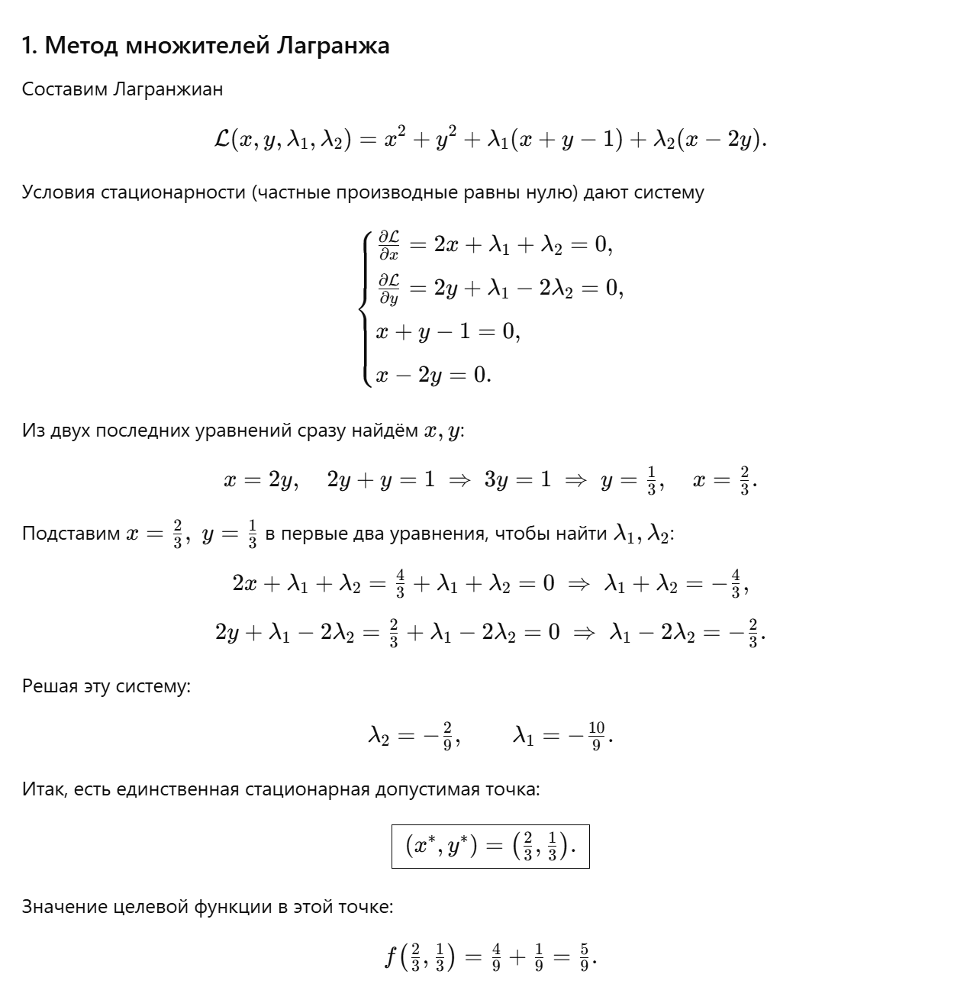
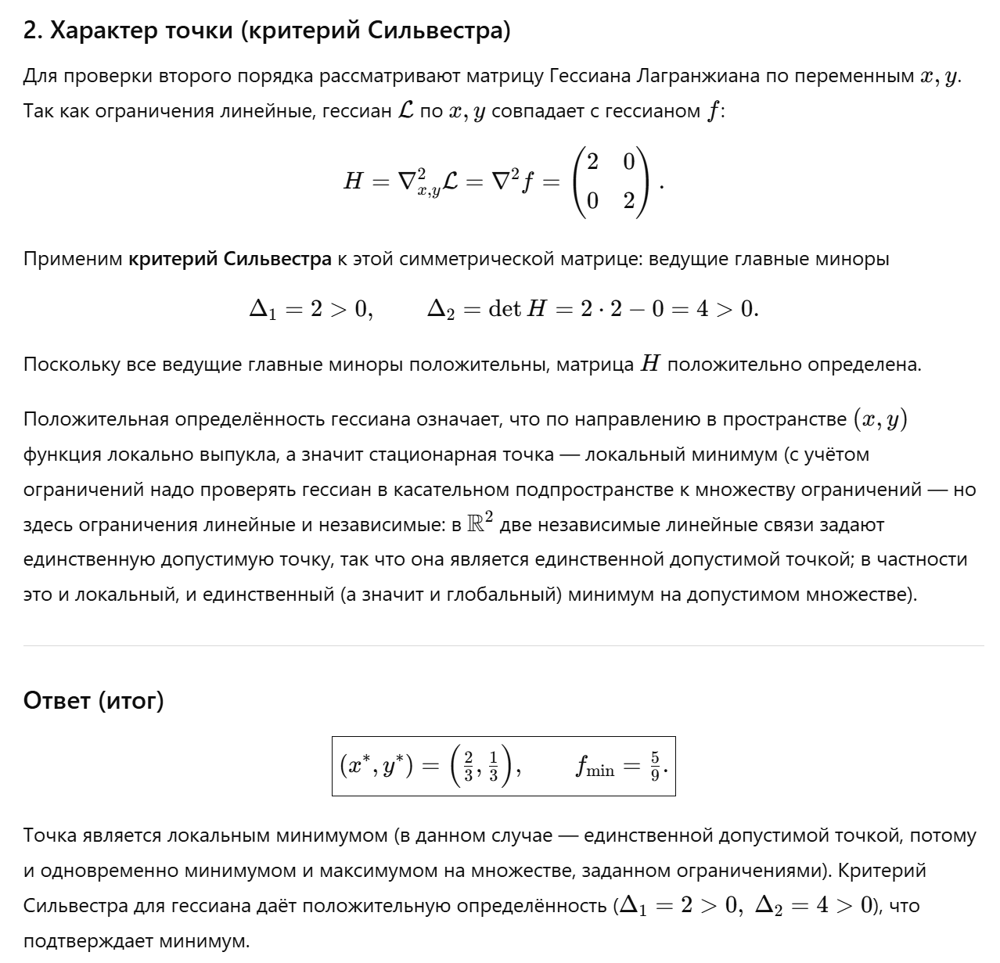

## Задание №3. Решение задачи условной выпуклой оптимизации с помощью метода множителей Лагранжа

#### Студент: Данилова Анастасия Алексеевна

#### Группа: МЕТОПТ 1.1

#### Вариант 1 (11-я в списке)

#### 1. Задание:

В работе предлагается решить задачу условной оптимизации с помощью метода множителей Лагранжа.
Текст задачи загружается промптом в БЯМ, а потом анализируется и проверяется корректность ее решения.

Предлагаемый промпт:

```text
Ниже приведена задача условной оптимизации, которую требуется решить с помощью метода множителей Лагранжа. Она записана в Markdown формате. Пожалуйста идентифицируй задачу и реши ее с помощью метода множителей Лагранжа. Проверь характер найденных точек с помощью критерия Сильвестра. 
Минимизировать $f(x,y)=x^2+y^2$ при

$$

g_1(x,y)=x+y-1=0,\quad g_2(x,y)=x-2y=0.

$$


```

#### 2. Вариант задания:

Минимизировать $f(x, y)=x^2+y^2$ при

$$
\begin{equation}
\begin{aligned}
g_1(x,y)=x+y-1=0, \\
g_2(x,y)=x-2y=0.
\end{aligned}
\end{equation}
$$

#### 3. Решение БЯМ



Нейросеть ChatGPT5 получила точку $M(\frac{2}{3}; \frac{1}{3})$ и $f(\frac{2}{3}; \frac{1}{3}) = \frac{5}{9}$



#### 4. Проверка и анализ решения БЯМ

В качестве целевой функции выступает функция $f(x, y) = x^2 + y^2.$
Перепишем ограничения задачи:

$$
\begin{equation}
\begin{aligned}
\phi_1(x, y) = x + y - 1 = 0. \\
\phi_2(x, y) = x - 2y = 0.
\end{aligned}
\end{equation}
$$

**4.1. Составим функцию Лагранжа:**
$$L(x, y, \lambda_1, \lambda_2) = x^2 + y^2 + \lambda_1(x + y - 1) + \lambda_2(x - 2y).$$

Составим систему:

$$
\begin{equation}
\begin{cases}
\frac{\partial L}{\partial x} = 2x + \lambda_1 + \lambda_2 = 0,\\
\frac{\partial L}{\partial y} = 2y + \lambda_1 - 2\lambda_2 = 0,\\
\frac{\partial L}{\partial \lambda_1} = x + y - 1 = 0,\\
\frac{\partial L}{\partial \lambda_2} = x - 2y = 0.
\end{cases}
\end{equation}
$$

Из двух нижних строк системы выразим $x$ и $y$:

$$x = 2y \Rightarrow 2y + y - 1 = 0 \Rightarrow y = \frac{1}{3}; \space x = \frac{2}{3}$$

Подставив найденные значения $x$ и $y$ подставим их в два первых уравнения, чтоб найти $\lambda_1$
и $\lambda_2$:

$$\lambda_1 = - \frac{10}{9}; \space \lambda_2 = -\frac{2}{9}$$

Получаем точку экстремума $M(\frac{2}{3}, \frac{1}{3})$.

Значение целевой функции в этой точке:
$$f(\frac{2}{3}, \frac{1}{3}) = \frac{4}{9} + \frac{1}{9} = \frac{5}{9}$$

**4.2. Определение типа экстремума в стационарных точках**

Рассчитаем значения частных производных второго порядка для функции Лагранжа:

$$
\begin{equation}
\begin{aligned}
\frac{\partial^2 L}{\partial x^2} = 2 \\
\frac{\partial^2 L}{\partial y^2} = 2 \\
\frac{\partial^2 L}{\partial x \partial y} = 0
\end{aligned}
\end{equation}
$$

Строим матрицу Гессе:
$$
\begin{vmatrix}  
2 & 0 \\  
0 & 2 \end{vmatrix}
$$

$$D_1 = a_{11} = 2 > 0; \space D_2 = 4 > 0$$

Таким образом, в точке $M(\frac{2}{3}, \frac{1}{3})$ матрица Гессе положительно определена и функция является
выпуклой. Точка $M(\frac{2}{3}, \frac{1}{3})$ является точкой минимума.

#### 5. Анализ решения БЯМ

**5.1. Функция Лагранжа: Составлена корректно.**

$$L(x, y, \lambda_1, \lambda_2) = x^2 + y^2 + \lambda_1(x + y - 1) + \lambda_2(x - 2y).$$

**5.2. Система уравнений: Выписана правильно из условий стационарности.**
$$
\begin{equation}
\begin{cases}
2x + \lambda_1 + \lambda_2 = 0,\\
2y + \lambda_1 - 2\lambda_2 = 0,\\
x + y - 1 = 0,\\
x - 2y = 0.
\end{cases}
\end{equation}
$$

**5.3. Решение системы: Найдено:**

$$y = \frac{1}{3}; \space x = \frac{2}{3}; \space \lambda_1 = - \frac{10}{9}; \space \lambda_2 = -\frac{2}{9}$$

**5.4. Значение функции:**

$$f(\frac{2}{3}, \frac{1}{3}) = \frac{5}{9}$$

**5.5. Анализ точки (критерий Сильвестра):**

* Матрица Гессе:

$$
\begin{vmatrix}  
2 & 0 \\  
0 & 2 \end{vmatrix}
$$

* Главные миноры: $\Delta_1 = 2 > 0, \space \Delta_2 = 4 > 0 \rightarrow$ матрица положительно определена.
* Вывод: точка $M(\frac{2}{3}, \frac{1}{3})$ - локальный минимум.


#### 6. Вывод по анализу

* Решение, предложенное БЯМ, полностью совпадает с моим самостоятельным решением.

* Все шаги выполнены корректно, ошибок не обнаружено.

* БЯМ корректно интерпретировала условие, составила функцию Лагранжа, решила систему и провела анализ второго порядка.

#### 7. Общий вывод
   Использование БЯМ для проверки решений задач условной оптимизации является эффективным и надёжным инструментом,
   особенно при условии, что пользователь обладает достаточными знаниями для верификации результата. В данном случае
   модель не допустила ошибок и может быть рекомендована для использования в учебных целях.