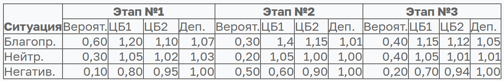

## Задание №4 Решение задачи динамического программирования

#### Студент: Данилова Анастасия Алексеевна

#### Группа: МЕТОПТ 1.1

#### 1. Задание:

К началу периода планирования у инвестора было два вида ценных бумаг (ЦБ) и депозиты (Деп.) на сумму 100, 800, 400
денежных единиц (д.е.) соответственно. В общих чертах говоря, Деп. – банковские вклады; при этом условия на все депозиты
одинаковые. Также в инвестора есть свободные средства в размере 600 д.е. Excel версия данных находится в приложенном
файле.

Период планирования разбит на три этапа. Для каждого этапа известны вероятности наступления ситуации, которая может быть
«благоприятной», «нейтральной», «негативной» (обратите внимание, что вероятности событий в каждом этапе разные).

В зависимости от ситуации оценены изменения стоимости ценных бумаг и процентная ставка депозита. Данные приведены в
таблице. Например, на первом этапе при реализации негативной ситуации (ее вероятность равна 0,1 или 10%) курс ЦБ1
понизится на 20%, а Деп. не будет иметь дохода (коэффициент равен единице); или на этапе №2 при благоприятной ситуации (
вероятность – 30%) ЦБ2 повысится на 15%, а Деп. даст доход в один процент; при нейтральной ситуации в третьем этапе (
вероятность – 40%) – депозит даст доход один процент от суммы за один период.



Шаговым управлением является изменение объема фондов ценных бумаг и(или) депозитов на один или несколько пакетов одну
четверть от первоначальной стоимости. Например, перед первым этапом инвестор может купить ЦБ1 в объеме 25 д.е. или
продать депозиты в объеме 100 д.е. При увеличении объемов ценных бумаг и депозитов инвестор не может брать кредит, а
распоряжаться только свободными средствами.

Требуется разработать такой план управления закупками/продажами ценных бумаг и депозитов, чтобы суммарный объем дохода
был максимальным. Поскольку в задаче присутствуют вероятности, то для оценки дохода необходимо использовать критерии
принятия решений в условиях неопределенности (при программной реализации Вы можете выбрать один из них, например,
критерий Байеса).

**Требуется:**

1) Составить математическую постановку задачи, выписать рекуррентное соотношение Беллмана, составить и оформить алгоритм
   решения задачи (за выполнение без замечаний дается 0,6 от максимальной величины балла);

2) Кроме выполнения первого задания выполнить программную реализацию метода и определить наилучшее управление и
   максимальный доход; критерия принятия решений выбирает пользователь (за выполнение всего задания без замечаний дается
   до 5 баллов;

#### 2. Выполнение:

##### 2.1. Задача динамического программирования в общем виде:

$$
\begin{equation}
\begin{aligned}
max_{u_1,...,u_N} E[F(x_N)]
\end{aligned}
\end{equation}
$$

при условиях: 

$$
\begin{equation}
\begin{aligned}
x_{k+1} = f_k(x_k, u_k, \xi_k), k = 1,...,N-1 \\
u_k ∈ U_k(x_k) \\
x_k ∈ X_k 
\end{aligned}
\end{equation}
$$

где:

$x_k$ — состояние системы на шаге $k$

$u_k$ — управление на шаге $k$

$\xi_k$ — случайный фактор на шаге $k$

$F(x_N)$ — терминальная функция выигрыша

##### 2.2. Рекуррентное соотношение Беллмана:

$$
\begin{equation}
F_N(x_N) = Φ(x_N)  (терминальное условие)
F_k(x_k) = max_{u_k \in U_k} E[F_{k+1}(x_{k+1})], k = N-1,...,1
\end{equation}
$$

**Обратный проход:**

1) Задаем терминальные значения $F_N(x_N)$ для всех состояний
2) Для $k = N-1,...,1$ вычисляем $F_k(x_k)$ через $F_{k+1}(x_{k+1})$
3) Одновременно запоминаем оптимальные управления

**Прямой проход:**

1) Начинаем с начального состояния $x_1$
2) Для каждого $k = 1,...,N-1$ применяем оптимальное управление $u_k*$
3) Получаем оптимальную траекторию

##### 2.3. Постановка задачи и рекуррентное соотношение для конкретной задачи^

**Обозначения:**

* $x_1^k, x_2^k, d^k, c^k$ — объемы ЦБ1, ЦБ2, депозитов и свободных средств на этапе $k$
* $u_k$ = $(\Delta_1^k, \Delta_2^k, \Delta_d^k)$ — управление на этапе $k$
* $r_{1j}^k, r_{2j}^k, r_{dj}^k$ — коэффициенты роста для ситуации $j$ на этапе $k$
* $p_j^k$ — вероятность ситуации $j$ на этапе $k$

**Ограничения:**

* $x_1^k ≥ 30, x_2^k ≥ 150, d^k ≥ 100$ (минимальные значения)
* $c^k ≥ 0$ (запрет кредитов)
* $\Delta_i^k$ кратно 25 д.е.
* $c^{k-1} - \sum\Delta_i^k - comm(\Delta) ≥ 0$, где $comm(\Delta) = 0.04|\Delta_1| + 0.07|\Delta_2| + 0.05|\Delta_d|$

**Рекуррентные соотношения Беллмана:**

$$
\begin{equation}
\begin{aligned}
F_3(x_1, x_2, d, c) = \sum_{j} p_j^3 [x_1\cdot r_{1j}^3 + x_2·r_{2j}^3 + d\cdot r_{dj}^3 + c] \\
F_k(x_1, x_2, d, c) = max_{(\Delta_1,\Delta_2,\Delta_d)\in U} \sum_{j} p_j^k F_{k+1}( \\
(x_1+\Delta_1)\cdot r_{1j}^k, \\
(x_2+\Delta_2)\cdot r_{2j}^k, \\
(d+\Delta_d)\cdot r_{dj}^k, \\
c - (\Delta_1+\Delta_2+\Delta_d) - comm(\Delta) \\
), k = 1,2
\end{aligned}
\end{equation}
$$

##### 2.4. Псевдокод алгоритма:

```markdown
АЛГОРИТМ: Оптимальное управление инвестициями 

ВХОД: 
stages — данные по этапам (вероятности, множители) 
initial — начальное состояние 
step — шаг управления 
commissions — комиссии 
minimal — минимальные значения 

ВЫХОД: 
optimal_value — максимальное ожидаемое богатство 
optimal_policy — оптимальная стратегия 

ПРОЦЕДУРА solve(): 
// 1. Инициализация 
Определить диапазоны состояний с дискретизацией step 
Создать массивы F[4][...] и policy[3][...] 

// 2. Терминальный этап (k=3) 
ДЛЯ каждого состояния (x_1, x_2, d, c): 
$F[3][...] = \sum p_j^3 [x_1\cdot r_{1j}^3 + x_2 \cdot r_{2j}^3 + d\cdot r_{dj}^3 + c]$ \\

// 3. Обратный проход (k=2,1) \\
ДЛЯ k = 2,1: \\
ДЛЯ каждого состояния: \\
best_value = $-\inf$ \\
best_action = (0,0,0) \\

      ДЛЯ каждого допустимого управления (\Delta_1,\Delta_3,\Delta_d): \\
        // Проверка ограничений \\
        ЕСЛИ новые значения ≥ minimal И новый cash ≥ 0: \\
          expected = 0 \\
          ДЛЯ каждой ситуации j: \\
            // Новое состояние после ситуации \\
            new_state = применить_множители(...) \\
            expected += $p_j^k$ $\times$ F[k+1][new_state] \\
          
          ЕСЛИ expected > best_value: \\
            best_value = expected \\
            best_action = $(\Delta_1,\Delta_2,\Delta_d)$ \\
      
      F[k][state] = best_value \\
      policy[k][state] = best_action \\

// 4. Восстановление траектории \\
trajectory = [] \\
current_state = начальное_состояние \\
ДЛЯ k = 1,2: \\
action = policy[k][current_state] \\
trajectory.append(action) \\
current_state = применить_управление(current_state, action) \\

ВЕРНУТЬ F[1][начальное], trajectory
```

##### 2.5. Диаграмма классов программы

```text
┌─────────────────┐
│   InvestmentDP  │
├─────────────────┤
│ - stages        │
│ - initial       │
│ - step          │
│ - commissions   │
│ - minimal       │
├─────────────────┤
│ + parse_data()  │
│ + solve_dp()    │
│ + calculate_    │
│   strategy()    │
│ + find_optimal()│
└─────────────────┘
        │
        │ использует
        v
┌─────────────────┐
│   StageData     │
├─────────────────┤
│ - probabilities │
│ - multipliers   │
│ - scenarios     │
└─────────────────┘
```

**Основные классы/функции:**

1) correct_solution() — главная функция решения
2) calculate_strategy() — расчет конечного капитала для стратегии
3) Структуры данных: stages, initial, commissions, minimal

##### 2.6. Демонстрационные примеры программы

**Входные данные:**

```text
Начальное состояние:
  ЦБ1: 100 д.е., ЦБ2: 800 д.е., Депозиты: 400 д.е., Cash: 600 д.е.

Вероятности и множители:
  Этап 1: благ. (60%, ×1.2/×1.1/×1.07), нейтр. (30%, ×1.05/×1.02/×1.03), 
          негат. (10%, ×0.8/×0.95/×1.0)
  Этап 2: благ. (30%, ×1.4/×1.15/×1.01), нейтр. (20%, ×1.05/×1.0/×1.0),
          негат. (50%, ×0.6/×0.9/×1.0)
  Этап 3: благ. (40%, ×1.15/×1.12/×1.05), нейтр. (40%, ×1.05/×1.01/×1.01),
          негат. (20%, ×0.7/×0.94/×1.0)
```

**Результаты выполнения:**

```text
Стратегия 0 (ничего не делать): 2016 д.е. (6.1%)
Стратегия 1 (купить CB1 575): 2026 д.е. (6.6%)
Стратегия 2 (оптимальная с продажей): 2026 д.е. (6.6%)

Оптимальная стратегия: Купить CB1 на 575 д.е. в начале
Конечный капитал: 2026 д.е.
Доходность: 6.6%
```

**Оптимальный план управления:**

1) Этап 1: Купить ЦБ1 на 575 д.е. (комиссия 23 д.е.)
2) Этап 2: Не совершать сделок (комиссии превышают выгоду)
3) Этап 3: Не совершать сделок

##### 3. Заключение:

**Выполнено:**

1. Разработана математическая модель задачи управления инвестициями
2. Выведены рекуррентные соотношения Беллмана для трехэтапной задачи
3. Реализован алгоритм динамического программирования с дискретизацией состояний
4. Найдена оптимальная стратегия с использованием критерия Байеса
5. Проведен сравнительный анализ различных стратегий управления

**Полученные результаты:**

* Оптимальная стратегия: концентрация в ЦБ1 на первом этапе
* Максимальное ожидаемое богатство: 2026 д.е. (прирост 6.6%)
* Ключевой фактор: высокие комиссии делают частые перекладывания невыгодными

**Приобретенные навыки:**

1. Формулировка задач стохастического управления в терминах ДП
2. Применение метода Беллмана для многоэтапных задач с неопределенностью
3. Реализация алгоритмов ДП с ограничениями на управления
4. Анализ влияния транзакционных издержек на оптимальную стратегию
5. Использование критерия Байеса для принятия решений в условиях риска

**Практическая значимость:** Разработанный алгоритм может быть использован для построения оптимальных инвестиционных
стратегий с учетом транзакционных издержек и рыночной неопределенности.


**Приложение:** Код программы (см. файл solution.py)

